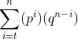

# TLC Probability Calculator

Estimate the probability of a successful Sybil Attack on a (n, t)-threshold secret sharing scheme.

# Background

In an (n, t)-threshold secret sharing scheme, a private key is divided among n players. However, only t players are required to reconstruct the secret. This provides security and fault tolerance. 

    0 < t <= n

Players are chosen from a pool of eligible players. An attacker wishing to get secrets early may attempt a Sybil Attack where they masquerade as many different users. If there is a p probability of choosing a player controlled from the pool of eligible players, what are the odds that the attacker will control at least t players (the number required to reveal a secret)?

# Definitions

**p** - Probability of choosing an attacker controlled player. If the attacker controls 10% of the eligible players then p = .1  
**n** - Number of secret shares  
**t** - Threshold of secret shares required to reconstruct the secret  

# Usage

    $ python tlc_calc.py p n t

# Example

    $ python tlc_calc.py .1 10 8
    p = 0.1
    n = 10
    t = 8
    P(a >= t) = 9.1e-09

# Calculation

### LaTeX Format

    \sum_{i=t}^{n} (p^i)(q^n^-^i)

# Limitations

Calculation is an estimate. A single player would never be chosen twice, so each time an attacker-controlled player is chosen, the odds of choosing the attacker again decrease. Assuming a large N, the difference is small.